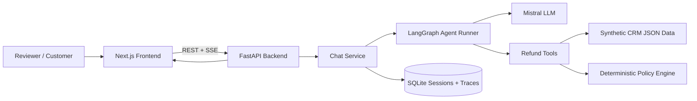
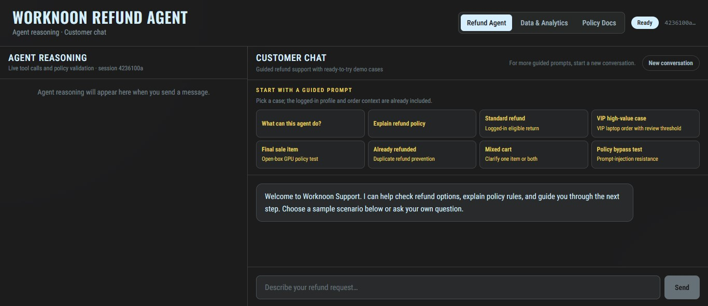
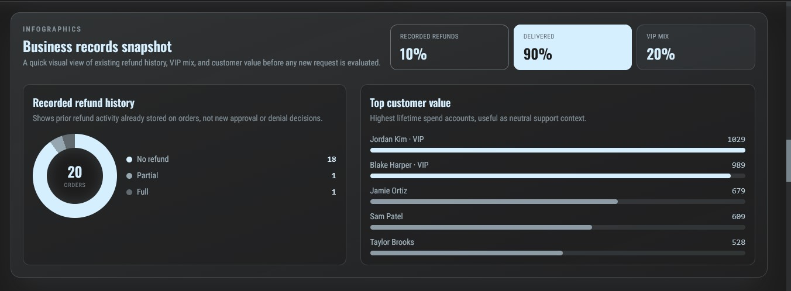

# Worknoon Refund Agent

## Project Description

Worknoon Refund Agent is a containerized AI support demo for a synthetic consumer-electronics store. It lets a customer ask for a refund, then shows how the agent checks customer records, order details, refund policy, and validation rules before giving an answer.

The included data is fully local demo data: customers, VIP tiers, electronics orders, delivery status, previous refund history, final-sale products, high-value purchases, and policy rules. The app includes a customer chat window, guided refund prompts, live agent reasoning, policy/tool traces, and a data analytics page showing the seeded business records.

The key idea is simple: the LLM helps communicate and call tools, but refund decisions are grounded in deterministic backend policy checks.

## Setup Instructions

### Prerequisites

Install [Docker Desktop](https://www.docker.com/products/docker-desktop/) and get a Mistral API key from the [Mistral Console](https://console.mistral.ai/). The reviewer does not need to manually prepare any data.

### 1. Clone The Repository

```bash
git clone <repository-url>
cd refund-agent
```

### 2. Set Up Environment

Create a `.env` file in the project root:

```bash
# Windows
copy .env.example .env

# macOS/Linux
cp .env.example .env
```

Open `.env` and replace the placeholder with your Mistral key:

```env
MISTRAL_API_KEY=your_mistral_api_key_here
MISTRAL_MODEL=mistral-small-latest
```

### 3. Run With Docker

Run this command from the project root, where `docker-compose.yml` is located:

```bash
docker compose up --build
```

Open `http://localhost:3000` in your browser. Stop the app with `Ctrl+C`, then run `docker compose down` if needed.

## Workflow

After opening the app, start from the **Refund Agent** page. The chat window includes prebuilt guided prompts for convenience, so the reviewer can test common cases without typing long examples manually.

Try prompts such as standard refund, VIP high-value case, final-sale item, already refunded order, mixed cart, and policy bypass test. When a prompt is selected, the agent reads the request, calls backend tools, checks the matching order and customer data, applies the refund policy, and returns an approval, denial, or escalation.

The **Agent Reasoning** panel shows live tool calls and validation steps. The **Data & Analytics** page shows the seeded CRM/order data and scenario cards. These cards start from the default demo state and are useful for understanding what records the agent is checking.

## System Architecture



The frontend is a responsive Next.js interface with customer chat, admin reasoning, analytics, and policy views. The backend exposes FastAPI endpoints for chat, health, analytics, and streaming trace events. The agent uses LangGraph-style tool flow with Mistral for reasoning, while Python policy code makes the final eligibility rules deterministic.

## Agent Flow Overview

1. The user sends a refund request or selects a guided prompt.
2. The backend creates or resumes a chat session.
3. The agent decides which tools are needed.
4. Tools fetch customer data, order data, policy excerpts, and refund eligibility.
5. The deterministic policy engine returns the allowed action and maximum refund amount.
6. A validation step blocks unsafe approvals, wrong amounts, and policy mismatches.
7. The final answer is streamed back to the UI with live reasoning traces.

## Tech Stack

- **Next.js + React:** Builds the responsive frontend, chat UI, analytics page, and policy pages.
- **Tailwind CSS:** Provides the dark Worknoon UI styling and responsive layout classes.
- **FastAPI:** Serves backend APIs, health checks, analytics data, and chat streaming.
- **Server-Sent Events:** Streams agent progress, tokens, tool calls, and decisions to the UI.
- **LangGraph / LangChain:** Orchestrates the agent loop and tool-calling workflow.
- **Mistral:** Powers the natural-language assistant responses and tool selection.
- **Python Policy Engine:** Applies deterministic refund rules so the LLM cannot override policy.
- **SQLite:** Stores sessions, messages, recommendations, and trace events.
- **Docker Compose:** Runs the frontend and backend together with one command.

## Screenshots

### Refund Agent



### Data & Analytics


### Business Records Snapshot



Created by **Mohammed Saqhib Bilal**
